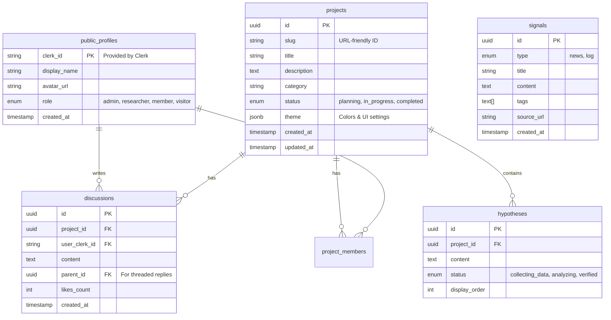

# **03. Data Schema & Models**

**Target Database:** Supabase (PostgreSQL)

本プロジェクトでは、個人情報（PII）を扱わないため、Supabaseの auth.users は使用せず、ClerkのユーザーIDをキーとした独自の public_profiles テーブルでユーザーを管理する。

## **1. ER Diagram**

## **2. Table Definitions**

### **A. Users (public_profiles)**

Clerk上のユーザー情報の「写し（Cache）」および、本アプリ独自のロール情報を管理する。

* **clerk_id (PK):** Clerkから発行されるUser ID（例: user_2pI...）。PIIではない。
* **role:**
  * admin: サイト管理者（全権限）
  * researcher: プロジェクト作成・編集権限
  * member: 議論への参加、プロジェクトへの参加
  * visitor: 閲覧のみ（DBには保存されない場合もある）

### **B. Projects (projects)**

実験プロジェクトの基本情報。

* **theme (JSONB):** プロジェクト固有のカラーリング設定。
  * 例: { "primary": "blue-500", "bg": "blue-50" }

### **C. Hypotheses (hypotheses)**

プロジェクトに紐づく「検証項目（Research Items）」。

* **status:** 進捗状況を可視化するためのステータス。

### **D. Discussions (discussions)**

プロジェクトに対するオープンな議論。

* **Zero PII:** ここにはユーザーの個人情報は一切含まない。表示時は public_profiles をJOINして表示名を取得する。
* **Threading:** parent_id を持つことで、スレッド形式（返信）に対応。

### **E. Signals (signals)**

AIエージェントによるニュース収集や、実験の進捗ログ。

* **type:** news（外部情報）か log（内部活動）かを区別。

### **F. Project Members (project_members)**

プロジェクトへの参加メンバーシップを管理。

* **role:**
  * owner: プロジェクトオーナー（全権限）
  * maintainer: メンテナー（編集権限）
  * contributor: 貢献者（議論参加、タスク実行）
* **UNIQUE制約:** 同一プロジェクトに同一ユーザーは1度のみ参加可能

## **3. Security Policies (RLS)**

Supabaseの Row Level Security (RLS) を使用し、データの読み書き権限を制御する。

* **Select (Read):**
  * 全テーブル: true (誰でも閲覧可能 / Public)
* **Insert/Update (Write):**
  * discussions: 認証済みユーザー（Clerk IDを持つ者）のみ許可。自分の投稿のみ編集可能。
  * projects, hypotheses, signals: role = admin | researcher を持つユーザーのみ許可。
