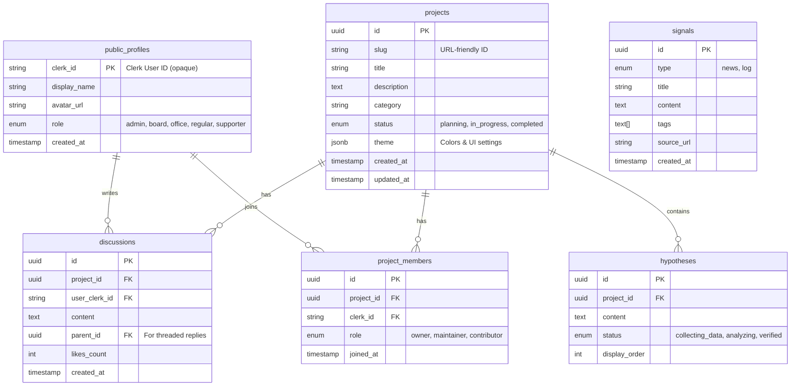

# 12. Data Schema

**Version:** 2.0
**Created:** 2026-02 with Claude Code (Sonnet 4.5)

このドキュメントでは、nexs-webのデータベース設計、Clerkとの連携方法、セキュリティポリシーについて説明します。

---

## 1. Database Overview

nexs-webは、**Supabase（PostgreSQL）** を使用してデータを管理します。

### Zero PII Strategy

**個人を特定できる情報（PII）は自前のデータベースに保存しません。**

- **認証・個人情報:** Clerk（外部SaaS）に委任
- **Self-hosted DB:** Clerkから発行された不可逆なID文字列のみを保存
- **メリット:** 侵害されても「公開済みデータ + 無意味なID」のみ流出

### Data Separation

| データ種類 | 保存場所 | 理由 |
|-----------|---------|------|
| **個人情報** (Email, Password) | Clerk | PII管理の専門基盤に委任 |
| **公開コンテンツ** (記事, 議案) | Git Repository (MDX) | バージョン管理、透明性 |
| **動的データ** (議論, プロジェクト) | Supabase | リアルタイム性が必要 |

---

## 2. ER Diagram



---

## 3. Table Definitions

### public_profiles

Clerk上のユーザー情報の「写し」および、組織内でのロール情報を管理します。

| Column | Type | Description |
|--------|------|-------------|
| clerk_id | string (PK) | Clerkから発行されるUser ID（例: user_2pI...）<br>**PIIではない不可逆なID** |
| display_name | string | 表示名（Clerkから同期） |
| avatar_url | string | アバター画像URL（Clerkから同期） |
| role | enum | 組織内でのロール（後述） |
| created_at | timestamp | レコード作成日時 |

**ロール定義:**

| Role | 権限 | 用途 |
|------|------|------|
| `admin` | 全権限 | システム管理者 |
| `board` | 議案承認、意思決定 | 理事メンバー |
| `office` | 法人運営、規程参照 | 事務局メンバー |
| `regular` | 研究参加、記事閲覧 | 正会員 |
| `supporter` | 閲覧、コメント | 賛助会員 |

**重要:** このロールはClerkの `public_metadata.role` から同期されます。詳細は `11_SYSTEM_ARCHITECTURE.md` Section 7 を参照してください。

---

### projects

研究プロジェクトの基本情報。

| Column | Type | Description |
|--------|------|-------------|
| id | uuid (PK) | プロジェクトID |
| slug | string | URL-friendly ID（例: digital-twin） |
| title | string | プロジェクト名 |
| description | text | プロジェクト説明 |
| category | string | カテゴリ |
| status | enum | `planning`, `in_progress`, `completed` |
| theme | jsonb | プロジェクト固有のカラーリング設定<br>例: `{"primary": "blue-500", "bg": "blue-50"}` |
| created_at | timestamp | 作成日時 |
| updated_at | timestamp | 更新日時 |

---

### hypotheses

プロジェクトに紐づく「検証項目（Research Items）」。

| Column | Type | Description |
|--------|------|-------------|
| id | uuid (PK) | 仮説ID |
| project_id | uuid (FK) | 所属プロジェクトID |
| content | text | 仮説の内容 |
| status | enum | `collecting_data`, `analyzing`, `verified` |
| display_order | int | 表示順序 |

---

### discussions

プロジェクトに対するオープンな議論。

| Column | Type | Description |
|--------|------|-------------|
| id | uuid (PK) | 議論ID |
| project_id | uuid (FK) | 所属プロジェクトID |
| user_clerk_id | string (FK) | 投稿者のClerk ID |
| content | text | 議論内容 |
| parent_id | uuid (FK) | 親コメントID（スレッド形式の返信用） |
| likes_count | int | いいね数 |
| created_at | timestamp | 投稿日時 |

**Zero PII設計:**
- ユーザーの個人情報は一切含まない
- 表示時は `public_profiles` をJOINして表示名・アバターを取得
- Clerk IDは不可逆なID文字列であり、PIIではない

---

### signals

AIエージェントによるニュース収集や、実験の進捗ログ。

| Column | Type | Description |
|--------|------|-------------|
| id | uuid (PK) | シグナルID |
| type | enum | `news`（外部情報）または `log`（内部活動） |
| title | string | タイトル |
| content | text | 内容 |
| tags | text[] | タグ配列 |
| source_url | string | ソースURL |
| created_at | timestamp | 作成日時 |

---

### project_members

プロジェクトへの参加メンバーシップを管理。

| Column | Type | Description |
|--------|------|-------------|
| id | uuid (PK) | メンバーシップID |
| project_id | uuid (FK) | プロジェクトID |
| clerk_id | string (FK) | メンバーのClerk ID |
| role | enum | `owner`, `maintainer`, `contributor` |
| joined_at | timestamp | 参加日時 |

**制約:**
- UNIQUE(project_id, clerk_id): 同一プロジェクトに同一ユーザーは1度のみ参加可能

**プロジェクト内ロール:**

| Role | 権限 |
|------|------|
| `owner` | プロジェクトオーナー（全権限） |
| `maintainer` | メンテナー（編集権限） |
| `contributor` | 貢献者（議論参加、タスク実行） |

---

## 4. Row Level Security (RLS)

Supabaseの Row Level Security (RLS) を使用し、データの読み書き権限を制御します。

### 基本方針

- **Read (SELECT):** 全テーブルで全員に公開（Public by Default）
- **Write (INSERT/UPDATE/DELETE):** 認証状態とロールに応じて制御

### ポリシー一覧

| テーブル | 操作 | 条件 |
|---------|------|------|
| **public_profiles** | SELECT | 全員許可 |
|  | INSERT/UPDATE | 認証済み、かつ自分のレコードのみ |
| **projects** | SELECT | 全員許可 |
|  | INSERT/UPDATE/DELETE | role = `admin` または `board` または `office` |
| **hypotheses** | SELECT | 全員許可 |
|  | INSERT/UPDATE/DELETE | role = `admin` または `board` または `office` |
| **discussions** | SELECT | 全員許可 |
|  | INSERT | 認証済みユーザー |
|  | UPDATE/DELETE | 認証済み、かつ自分の投稿のみ |
| **signals** | SELECT | 全員許可 |
|  | INSERT/UPDATE/DELETE | role = `admin` |
| **project_members** | SELECT | 全員許可 |
|  | INSERT/UPDATE/DELETE | プロジェクトのowner、またはrole = `admin` |

### セキュリティ境界

- **Public Zone:** 誰でもアクセス可能（記事、プロジェクト情報）
- **Authenticated Zone:** ログイン必要（議論投稿、マイデスク）
- **Role-based Zone:** 特定ロールのみ（議案承認、事務局機能）

---

## 5. Clerk Integration

### ユーザー同期フロー

1. ユーザーがClerkでログイン
2. Clerkが Session Token を発行（JWT）
3. Session Tokenに `role` カスタムクレームを埋め込み
4. フロントエンドで `sessionClaims.role` を読み取り
5. 初回ログイン時、`public_profiles` にレコードを自動作成

### 環境変数

```bash
PUBLIC_CLERK_PUBLISHABLE_KEY=pk_test_...
CLERK_SECRET_KEY=sk_test_...
```

### 型定義

`src/env.d.ts` に定義されたカスタムクレーム:

```typescript
interface CustomJwtSessionClaims {
  role?: 'admin' | 'board' | 'office' | 'regular' | 'supporter'
}
```

---

## 6. Migration Files

データベースのマイグレーションファイルは `supabase/migrations/` に配置されます。

**実行方法:**
- Supabase Dashboard → SQL Editor でマイグレーションファイルの内容を実行
- または Supabase CLI: `supabase db push`

詳細は `10_DEV_ENVIRONMENT.md` を参照してください。
